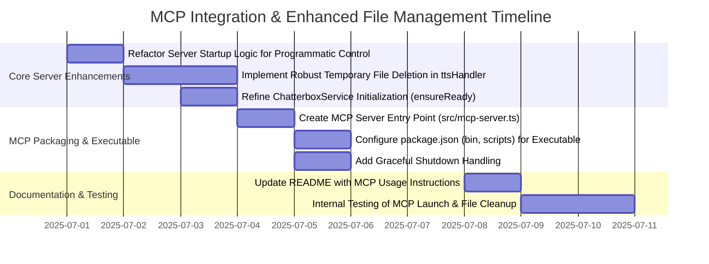

<chatName="MCP_Integration_and_File_Deletion_Plan"/>
Okay, let's break down the requirements for integrating the Local Voice TTS server into an MCP (Master Control Program) environment and ensuring robust temporary file management.

## 1. Analysis of Requested Changes

The core requests are:

1.  **Create a Product Requirements Document (PRD)** for the "MCP" feature. This PRD should outline how the existing TTS server will be wrapped or adapted to be easily usable by MCP clients like Cursor and Windsurf.
2.  **Implement Automatic File Deletion:** The generated `.wav` audio files must be deleted after successful streaming or if any error occurs during their processing or streaming.
3.  **MCP Compatibility:** The server should be launchable in a way that's compatible with an MCP setup, as exemplified by the `taskqueue` configuration:
    ```json
    "taskqueue": {
      "command": "npx",
      "args": ["-y", "taskqueue-mcp"],
      "env": {
        "TASK_MANAGER_FILE_PATH": "/Users/mikestaub/Desktop/node-sandbox/tasks.json"
      }
    }
    ```
    This implies our server needs an executable entry point that an MCP orchestrator (like `taskqueue-mcp` or a similar system) can spawn and manage. The orchestrator would then likely interact with our server via its HTTP API.

## 2. Product Requirements Document (PRD) for MCP Feature

**File to Create/Update:** `/Users/mikestaub/code/codecrafters/ai-coding-tools/local-voice-mcp/.project/feat/mcp/prd.md`

**Content:**

```markdown
# Local Voice MCP - MCP Integration Feature PRD

## 1. Introduction
**Problem**: The Local Voice TTS server, while functional, operates as a standalone HTTP service. Integrating it into larger MCP (Master Control Program) client ecosystems like Cursor or Windsurf requires manual setup and lacks standardized lifecycle management. Additionally, robust management of temporary audio files generated during synthesis is crucial for system stability and resource efficiency.
**Solution**: Develop an MCP-compatible wrapper and enhance the Local Voice TTS server. This involves providing a clear command-line entry point for the server, making it easily launchable and manageable by MCP orchestrators. Internal mechanisms for automatic cleanup of generated audio files will also be implemented.
**Key Benefits**:
- **Simplified Integration**: Allows MCP clients (e.g., Cursor, Windsurf via an orchestrator like `taskqueue-mcp`) to easily discover, launch, and manage the TTS service using standard MCP patterns.
- **Standardized Operation**: Provides a consistent command-line interface (e.g., `local-voice-mcp-server`) and supports configuration via environment variables (e.g., `PORT`).
- **Automated Resource Management**: Ensures temporary audio files are reliably deleted after use or in case of errors, preventing disk space clutter and improving system hygiene.
- **Improved Robustness**: Enhances error handling related to file operations and server lifecycle.

## 2. System Architecture
```mermaid
graph TD
    A[User Application\n(e.g., Cursor, Windsurf)] -->|Manages via MCP Config| B(MCP Orchestrator\n e.g., taskqueue-mcp)
    B -->|Spawns & Manages Process using 'local-voice-mcp-server' command| C[Local Voice MCP Server Process]
    C -->|Exposes HTTP API (e.g., localhost:59125/tts)| D[Chatterbox TTS Service Core (within Server Process)]
    D --> E[Chatterbox TTS Engine (Python)]
    E --> F[Audio Output Stream to Client]
    D --> G[Voice Model Cache]
    G --> E
    C -.->|Ensures Deletion| H{Temporary WAV Files}
    F -.-> H
```
*Diagram Explanation:* The User Application configures an MCP Orchestrator. The orchestrator uses the `local-voice-mcp-server` command to spawn and manage the TTS server as a separate process. This server process exposes the HTTP API (e.g., on `localhost:59125`). The TTS Service Core within the server handles requests, interacts with the Python-based Chatterbox TTS Engine, and streams audio back. A key responsibility of the Local Voice MCP Server is the automatic creation and subsequent deletion of temporary WAV files.

## 3. Features
### MCP Server Executable
- Provide a command-line executable (e.g., `local-voice-mcp-server`) for launching the TTS server.
- The server package should be publishable via `npm`, allowing easy installation and execution via `npx local-voice-mcp-server`.
- Support essential configuration via environment variables (e.g., `PORT` for the HTTP server).
- Handle standard process signals (e.g., SIGINT, SIGTERM) for graceful shutdown.

### Automated Audio File Cleanup
- Generated `.wav` files are stored in a designated temporary directory (e.g., within `os.tmpdir()`).
- Temporary audio files are automatically and reliably deleted after the audio data has been successfully streamed to the client.
- Temporary audio files are automatically and reliably deleted if an error occurs at any stage after file creation (synthesis, file system operations, streaming).

### Inherited TTS Capabilities
- All existing features of the core TTS service remain available through the HTTP interface provided by the MCP-run server:
    - High-quality text-to-speech conversion.
    - Support for multiple voices and languages (as per Chatterbox capabilities).
    - Voice cloning from reference audio.
    - Prosody controls (pitch, speed, emotion - as supported by `tts_runner.py`).
    - ElevenLabs-compatible JSON API schema for the `/tts` endpoint.

## 4. Technical Specifications
### Server Executable (`local-voice-mcp-server`)
- **Entry Point:** A new TypeScript file (e.g., `src/mcp-server.ts`) compiled to JavaScript. This script will be designated as the main executable in `package.json`'s `bin` field.
- **Functionality:**
    - Parses command-line arguments or environment variables for configuration (e.g., port).
    - Initializes and starts the Express HTTP server.
    - Implements graceful shutdown logic.
- **Packaging:** Configured in `package.json` to allow `npm install [-g] local-voice-mcp` and execution via `local-voice-mcp-server` or `npx local-voice-mcp-server`.

### File Deletion Logic
- **Location:** Implemented primarily within the `ttsHandler` function in `src/server.ts`.
- **Mechanism:** Utilize `try...catch...finally` blocks around file operations and streaming. The `finally` block will be responsible for invoking `fs.unlink` on the temporary audio file path.
- **Path Safety:** Continue to use `os.tmpdir()` for creating temporary files. All file paths involved in deletion must be validated to ensure they are within the expected temporary directory, preventing accidental deletion of other files.

### HTTP API (`/tts` endpoint)
- No changes to the existing API contract (`POST /tts` with JSON body and audio/wav response).
- The MCP integration focuses on how the server providing this API is managed, not on changing the API itself.

### Configuration
- **Port:** Configurable via `PORT` environment variable. Default to `59125`.

## 5. Development Roadmap


## 6. Security Considerations
- **File System Permissions:** The server process, when deleting files, must operate with the least privilege necessary. File deletion operations must be strictly confined to the application's designated temporary directory. Path validation is critical.
- **Process Management:** When launched by an MCP orchestrator, the server process should inherit or be assigned appropriate, non-excessive permissions.
- **Input Sanitization:** Continue to sanitize any inputs used to construct file paths or commands (already partially addressed in `ChatterboxService` for Python script arguments).
- **Error Handling for Deletion:** Errors during file deletion should be logged comprehensively but should not cause the primary service (TTS generation) to crash or become unresponsive.
```

## 3. Implementation Plan

### 3.1. Enhance `ChatterboxService` for Explicit Initialization

*   **File:** `src/core/chatterbox.service.ts`
*   **Section:** `ChatterboxService` class
*   **Change 1: Add public `ensureReady` method**
    *   **Logic:** Expose the `environmentSetupPromise` via a public method to allow explicit awaiting of environment setup completion.
    *   **Signature:**
        ```typescript
        public async ensureReady(): Promise<void> {
          return this.environmentSetupPromise;
        }
        ```
    *   **Reasoning:** Allows the main application/server startup logic to wait for Python environment setup before accepting requests or declaring itself ready.

### 3.2. Refactor `src/server.ts` for Programmatic Control and Robust File Deletion

*   **File:** `src/server.ts`
*   **Change 1: Modify `ttsHandler` for robust file cleanup**
    *   **Location:** `ttsHandler` function.
    *   **Logic:**
        1.  Declare `audioPath` outside the main `try` block so it's accessible in `finally`.
        2.  Wrap the core logic (synthesize, stream) in a `try...catch...finally` structure.
        3.  The `finally` block will be responsible for deleting `audioPath` if it was created and still exists.
        4.  Ensure `audioPath` is validated to be within `TEMP_AUDIO_DIR` before attempting to stream or delete.
    *   **Example Snippet (conceptual for `ttsHandler`):**
        ```typescript
        async function ttsHandler(req: Request<{}, {}, TTSRequest>, res: Response) {
          let audioPath: string | undefined;

          try {
            const { text, options = {} } = req.body;
            // ... (validation of text) ...

            // This call might throw, or return a path
            audioPath = await chatterbox.synthesize(text, options);

            // Validate audioPath is within TEMP_AUDIO_DIR (critical)
            const resolvedPath = path.resolve(audioPath);
            const normalizedTempDir = path.normalize(TEMP_AUDIO_DIR) + path.sep;
            if (!resolvedPath.startsWith(normalizedTempDir)) {
              console.error(`Security Alert: Attempt to access file outside temp dir: ${resolvedPath}`);
              // Do not proceed with this path, do not attempt to delete it if it's outside temp.
              // audioPath should be considered invalid. For safety, set it to undefined.
              audioPath = undefined; 
              throw new Error('Invalid audio path generated.'); 
            }

            res.setHeader('Content-Type', 'audio/wav');
            // ... (other headers) ...

            const audioStream = fs.createReadStream(audioPath);
            
            // Return a promise that resolves/rejects based on stream events
            await new Promise<void>((resolvePromise, rejectPromise) => {
              audioStream.pipe(res);
              finished(audioStream, (err) => {
                if (err) {
                  console.error('Stream finished with error:', err);
                  rejectPromise(err); // This error will be caught by the outer catch
                } else {
                  resolvePromise();
                }
              });
              audioStream.on('error', (err) => {
                console.error('Audio stream error:', err);
                // Ensure response isn't sent twice
                if (!res.headersSent) {
                  // res.status(500).json({ error: 'Audio streaming failed' }); // Avoid, let outer catch handle
                } else {
                  res.end();
                }
                rejectPromise(err); // This error will be caught by the outer catch
              });
            });

          } catch (error) {
            console.error('Error in ttsHandler:', error);
            if (!res.headersSent) {
              res.status(500).json({ error: 'TTS processing failed' });
            }
          } finally {
            if (audioPath && fs.existsSync(audioPath)) {
              // Double-check path again before unlinking, though initial validation should suffice
              const resolvedPathFinal = path.resolve(audioPath);
              const normalizedTempDirFinal = path.normalize(TEMP_AUDIO_DIR) + path.sep;
              if (resolvedPathFinal.startsWith(normalizedTempDirFinal)) {
                fs.unlink(audioPath, (unlinkErr) => {
                  if (unlinkErr) {
                    console.error(`Error deleting temp file ${audioPath}:`, unlinkErr);
                  } else {
                    console.log(`Successfully deleted temp file: ${audioPath}`);
                  }
                });
              } else {
                 console.error(`Security Alert: Skipped deletion of suspicious path in finally block: ${audioPath}`);
              }
            }
          }
        }
        ```
    *   **Reasoning:** This structure ensures that `fs.unlink` is attempted for `audioPath` if it was set and the file exists, regardless of success or failure in the `try` block or streaming. Path validation before deletion in `finally` is an added safety measure.

*   **Change 2: Export a `startApp` function and make direct listen conditional**
    *   **Logic:**
        1.  Encapsulate the Express app setup and `app.listen()` call into an `async` function, say `startApp(port: number)`.
        2.  This function should `await chatterbox.ensureReady()` before starting the listener.
        3.  The existing `app.listen()` at the bottom of the file should be removed or made conditional (e.g., `if (require.main === module)`), so importing the file doesn't automatically start the server.
    *   **Example Signature & Structure:**
        ```typescript
        // At the top of src/server.ts, after imports and app/chatterbox instantiation:
        const app = express();
        const chatterbox = new ChatterboxService();
        // ... (middleware, TEMP_AUDIO_DIR setup) ...
        // ... (ttsHandler definition) ...
        // app.post('/tts', authenticate, ttsHandler);

        export async function startApp(port: number): Promise<void> {
          try {
            await chatterbox.ensureReady(); // Wait for Python env
            console.log('Chatterbox environment successfully initialized.');
          } catch (error) {
            console.error('Failed to initialize Chatterbox environment:', error);
            throw error; // Prevent server from starting if env setup fails
          }

          return new Promise((resolve, reject) => {
            const serverInstance = app.listen(port, () => {
              console.log(`Local Voice MCP server running at http://localhost:${port}`);
              resolve();
            });
            serverInstance.on('error', (err) => {
              console.error(`Server failed to start on port ${port}:`, err);
              reject(err);
            });
          });
        }

        // For direct execution (e.g., ts-node src/server.ts)
        if (require.main === module) {
          const defaultPort = parseInt(process.env.PORT || '59125', 10);
          startApp(defaultPort).catch(error => {
            console.error("Failed to start application directly:", error);
            process.exit(1);
          });
        }
        ```
    *   **Reasoning:** Allows the server to be imported and started programmatically by `src/mcp-server.ts` without side effects from just importing.

### 3.3. Create MCP Server Entry Point

*   **New File:** `src/mcp-server.ts`
*   **Purpose:** This will be the executable script for the MCP environment.
*   **Content:**
    ```typescript
    #!/usr/bin/env node

    import { startApp } from './server'; // Import the refactored startApp function

    const PORT = parseInt(process.env.PORT || '59125', 10);

    async function main() {
      console.log(`Attempting to start Local Voice MCP Server on port ${PORT}...`);
      try {
        await startApp(PORT);
        // The startApp promise resolves when the server is listening.
        // The process will stay alive due to the active HTTP server.
      } catch (error) {
        console.error('Failed to start Local Voice MCP server:', error);
        process.exit(1);
      }
    }

    // Graceful shutdown
    const signals: NodeJS.Signals[] = ['SIGINT', 'SIGTERM'];
    signals.forEach((signal) => {
      process.on(signal, () => {
        console.log(`\nReceived ${signal}. Shutting down Local Voice MCP server...`);
        // Perform any cleanup here if necessary (e.g., server.close())
        // For Express, active connections might keep it alive briefly.
        // process.exit() will eventually terminate.
        // If chatterbox service or python script need explicit shutdown, add here.
        console.log('Server shut down.');
        process.exit(0);
      });
    });

    main();
    ```
*   **Reasoning:** Provides a clean entry point for `npx` or direct execution, uses the `startApp` function from `src/server.ts`, and includes basic graceful shutdown handling.

### 3.4. Update `package.json`

*   **File:** `package.json`
*   **Change 1: Add `bin` field**
    *   **Logic:** Define the command-line interface for the package.
    *   **Snippet:**
        ```json
        {
          // ... other fields ...
          "bin": {
            "local-voice-mcp-server": "./dist/mcp-server.js"
          },
          // ...
        }
        ```
    *   **Note:** Assumes TypeScript output directory is `dist`. Adjust if different.

*   **Change 2: Add/Update `scripts`**
    *   **Logic:** Include a build script and potentially a script to run the MCP server locally.
    *   **Snippet:**
        ```json
        {
          // ...
          "scripts": {
            "test": "echo \"Error: no test specified\" && exit 1",
            "build": "tsc",
            "start": "ts-node src/server.ts", // For legacy direct start during dev
            "start:mcp": "npm run build && node dist/mcp-server.js", // Build and run MCP version
            "dev:mcp": "ts-node src/mcp-server.ts" // Run MCP version with ts-node for dev
          },
          // ...
        }
        ```
    *   **Reasoning:** `build` is essential for producing the `.js` files referenced in `bin`. `start:mcp` and `dev:mcp` provide convenient ways to run the MCP-ified server.

### 3.5. Update `.gitignore`

*   **File:** `.gitignore`
*   **Change:** Add TypeScript compilation output directory if not already present.
    *   **Snippet (add if `dist` is the output dir):**
        ```
        # TypeScript output
        dist/
        ```

## 4. Critical Architectural Decisions

1.  **MCP Interaction Model:** The plan assumes the MCP orchestrator spawns `local-voice-mcp-server` as a process and then interacts with it via its standard HTTP API. This is a common and robust pattern.
2.  **Server Entry Point:** A dedicated `mcp-server.ts` provides a clean separation for the executable part of the server, distinct from the library-like `server.ts` which defines the app.
3.  **File Deletion Strategy:** Using `try...finally` in `ttsHandler` is the most reliable way to ensure cleanup attempts are made. Strict path validation before deletion is crucial for security.
4.  **ChatterboxService Initialization:** Making `ensureReady()` explicit allows the server to confirm its backend dependencies (Python environment) are ready before it starts accepting traffic, improving startup reliability.

## 5. Potential Side Effects/Impacts

*   **Startup Time:** Explicitly awaiting `chatterbox.ensureReady()` might slightly increase server startup time if the Python environment setup is slow, but this is a trade-off for reliability.
*   **Error Handling:** More robust error handling in `ttsHandler` should lead to fewer unhandled exceptions but requires careful implementation to ensure all paths are covered.
*   **Build Process:** A `npm run build` step (compiling TypeScript) becomes mandatory before the `local-voice-mcp-server` executable can be used from the `dist` directory or after `npm install`.
*   **Existing `npm start`:** The conditional `app.listen()` in `src/server.ts` ensures that `npm start` (which likely uses `ts-node src/server.ts`) continues to work as before for development convenience.

This plan provides a comprehensive approach to meeting the user's requirements for MCP integration and robust file handling.