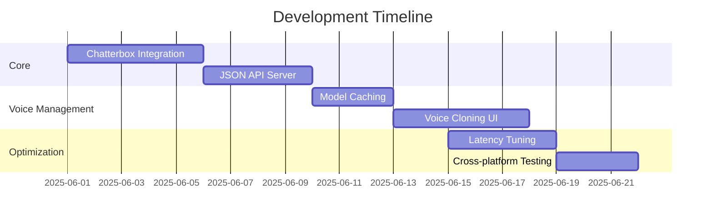

# Local Voice MCP - Product Requirements Document

## 1. Introduction
**Problem**: Current cloud-based TTS solutions pose privacy risks, introduce latency, and limit user control over voice data.  
**Solution**: Local voice generation using Chatterbox TTS to process audio directly on user devices.  
**Key Benefits**:
- **Privacy**: Zero data leaves the device
- **Latency**: Optimized response times
- **Control**: Advanced voice customization

## 2. System Architecture
```mermaid
graph TD
    A[User Application\n(Cursor/Windsurf)] -->|Paste JSON| B[Local Voice MCP]
    B --> C[Chatterbox TTS Engine]
    C --> D[Audio Output]
    B --> E[Voice Model Cache]
    E --> C
```

## 3. Features
### Core TTS
- High-quality text-to-speech conversion
- Support for 50+ voices across 20+ languages
- Real-time streaming with low latency

### Voice Cloning
- Create custom voices from 10-second samples
- Voice style adaptation
- Cross-lingual voice transfer

### Prosody Control
- Pitch, speed and volume adjustment
- Emotional tones (happy, sad, angry, etc.)
- Emphasis control for specific words

### API
- ElevenLabs-compatible JSON schema
- Local HTTP server (localhost:59125)
- Simple Python-based interface

## 4. Technical Specifications
### Chatterbox Integration
- Python-based TTS engine
- Optimized for low-latency streaming
- Model quantization for efficiency

### JSON API Schema
```json
{
  "text": "Hello world",
  "voice": "en_speaker_0",
  "options": {
    "pitch": 1.1,
    "speed": 1.2,
    "emotion": "neutral"
  }
}
```

### Performance Targets
- <100ms latency for short texts
- <8% CPU usage on Apple M1
- <300MB memory footprint
- GPU acceleration support

## 5. Development Roadmap


## 6. Security Considerations
- All voice models stored encrypted at rest
- Memory isolation for voice processing
- Sandboxed execution environment
- Secure model downloading