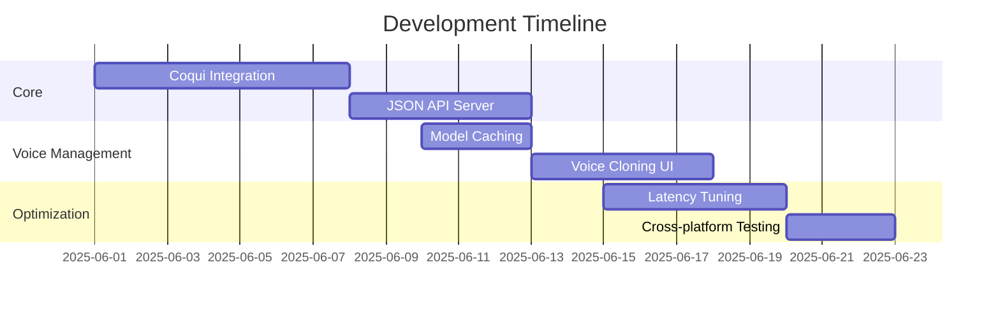

# Local Voice MCP - Product Requirements Document

## 1. Introduction
**Problem**: Current cloud-based TTS solutions pose privacy risks, introduce latency, and limit user control over voice data.  
**Solution**: Local voice generation using Coqui TTS to process audio directly on user devices.  
**Key Benefits**:
- **Privacy**: Zero data leaves the device
- **Latency**: Optimized response times
- **Control**: Advanced voice customization

## 2. System Architecture
```mermaid
graph TD
    A[User Application\n(Cursor/Windsurf)] -->|Paste JSON| B[Local Voice MCP]
    B --> C[Coqui TTS Engine]
    C --> D[Audio Output]
    B --> E[Voice Model Cache]
    E --> C
```

## 3. Features
### Core TTS
- High-quality text-to-speech conversion
- Support for 1000+ voices across 80+ languages
- Real-time streaming with low latency

### Voice Cloning
- Fine-tune custom voice models
- Create voices from 5-second samples
- Voice style transfer capabilities

### Prosody Control
- Pitch, speed and volume adjustment
- Emotional tones with intensity levels
- Voice style blending

### API
- ElevenLabs-compatible JSON schema
- Local HTTP server (localhost:59125)
- Cross-platform Python-based interface

## 4. Technical Specifications
### Coqui Integration
- Python-based TTS engine
- ONNX runtime for optimized performance
- Advanced model management system

### JSON API Schema
```json
{
  "text": "Hello world",
  "voice": "tts_models/en/ljspeech/tacotron2-DDC",
  "options": {
    "pitch": 1.2,
    "speed": 1.0,
    "emotion": "happy",
    "emotion_strength": 0.8
  }
}
```

### Performance Targets
- <200ms latency for short texts
- <10% CPU usage on Apple M1
- GPU acceleration support
- <500MB memory footprint

## 5. Development Roadmap


## 6. Security Considerations
- All voice models stored encrypted at rest
- Memory isolation for voice processing
- Sandboxed execution environment
- Secure model downloading